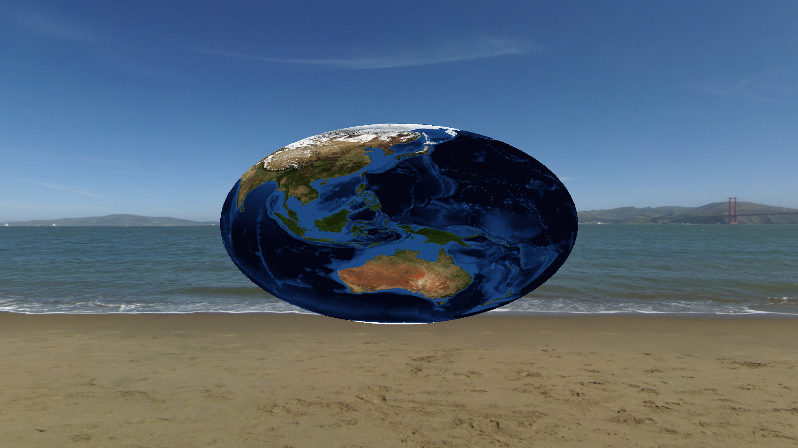
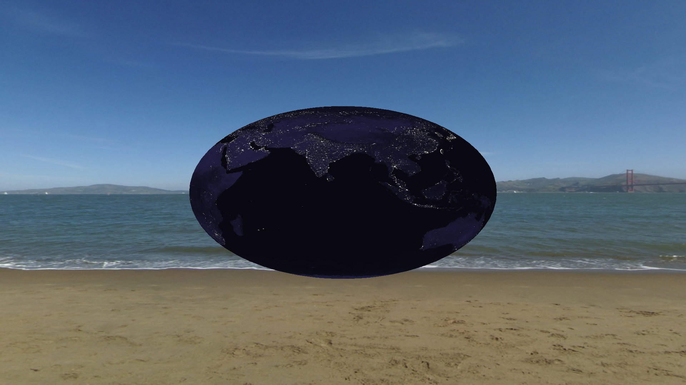
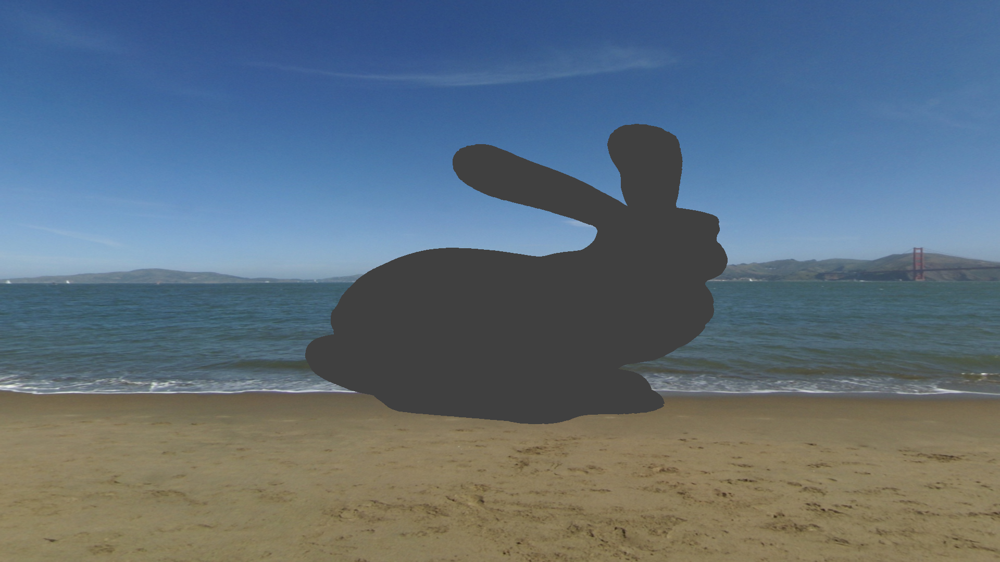
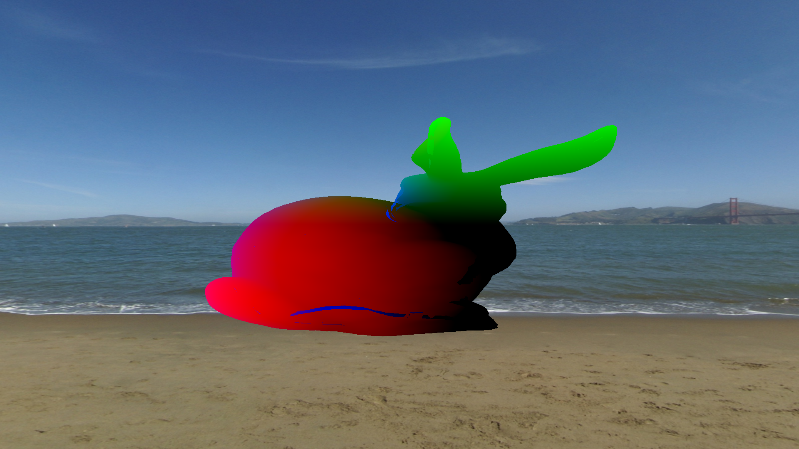
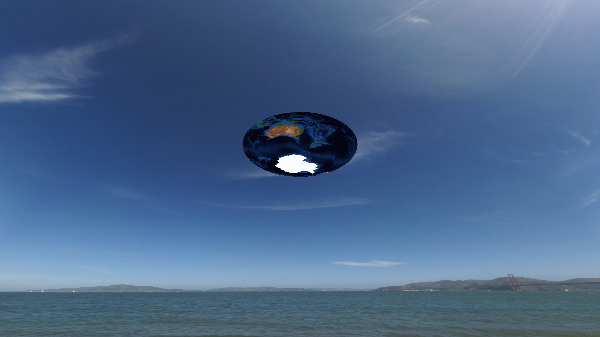

<h1> Rapport projet LMG </h1>

<h3>Truong Tan Dat</h3>

<h3>ISI</h3>

<h3>Liste des fonctionnalités</h3>
- Chargement d'un objet et texture:

On peut choisir la l'objet, la texture, ainsi que les shader à utiliser.

On peut également bouger la caméra autour de l'objet.

<h3>Environnement utilisé et dépendances</h3>

Pour installer les dépendances:

"make lib-deps"

Pour compiler:

"make"

On peut utiliser plusieurs options indépendantes lors de la commande make:

LD=1 pour utiliser le loader fait à la main, la texture est buguée.

NORM=0 pour désactiver la normalisation des sommets de l'objet, il ne sera donc pas centré et à une taille convenable pour la caméra.

DEBUG=0 pour désactiver les logs dans le dossier debug

Exemple de compilation:

"make LD=1 NORM=0"

Pour lancer le programme:

"./main" suivi des fichiers correspondants, on supposera que les fichiers sont au format correspondant: .obj pour les objets, .vert pour les vertex shaders, .frag pour les fragment shaders, .jpg pour les textures. Si aucun fichier n'est spécifié pour n'importe laquelle de ces entrées, une entrée par défaut à été définie, on peut donc lancer "./main" sans aucun argument ou avec un nombre variable d'arguments.
Si plusieurs fichiers au format correspondant sont transmis, on utilisera le dernier donné.

On peut bouger la caméra avec ZQSD et zqsd.

On peut désactiver/activer la rotation de l'objet avec la touche p.